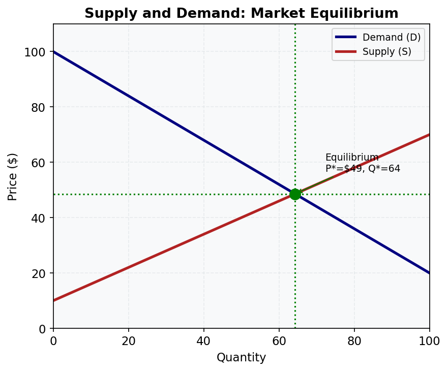
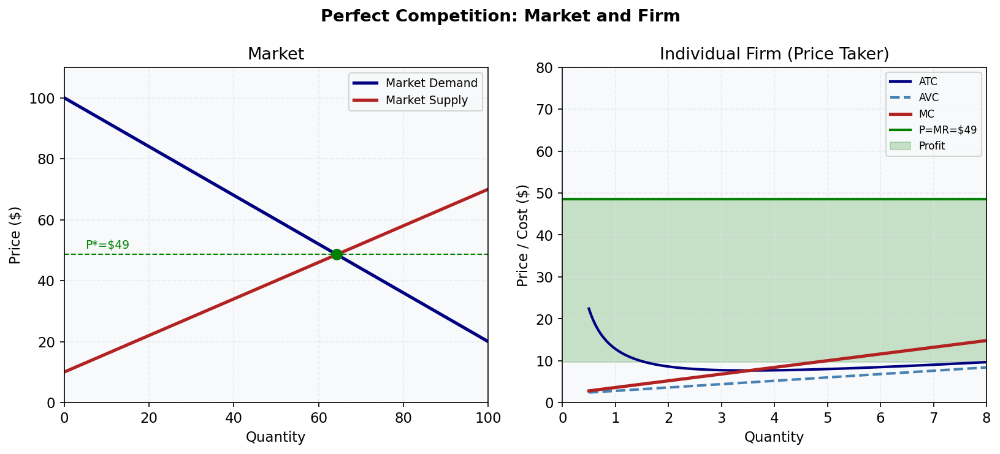

# 📊 Key Diagrams

*Core microeconomics diagrams for quick reference and revision*

---

## 1. Production Possibilities Frontier (PPF)

The PPF shows the maximum combinations of two goods an economy can produce with given resources and technology.

- **On the curve** — efficient (all resources fully employed)
- **Inside the curve** — inefficient (idle resources)
- **Outside the curve** — currently unattainable
- **Bowed-out shape** — increasing opportunity costs (resources not equally suited to all uses)
- **Outward shift** — economic growth (more resources or better technology)

*Relevant lessons: M01.L02*

---

## 2. Supply and Demand: Market Equilibrium

The market equilibrium is where the quantity demanded equals quantity supplied, determining price P* and quantity Q*.

- **Demand slopes down** — law of demand (higher price → lower quantity demanded)
- **Supply slopes up** — law of supply (higher price → higher quantity supplied)
- **Shortage** (P < P*): excess demand drives price up
- **Surplus** (P > P*): excess supply drives price down

*Relevant lessons: M04.L03, M04.L04, M04.L05*

---

## 3. Consumer and Producer Surplus

Economic surplus measures the gains from trade.

- **Consumer surplus (blue)** — area under demand curve, above market price (WTP − price paid)
- **Producer surplus (red)** — area above supply curve, below market price (price received − minimum acceptable)
- **Total surplus** = CS + PS = net gain to society from voluntary exchange
- **Competitive equilibrium maximises total surplus** — key efficiency result

*Relevant lessons: M05.L01, M05.L02*

---

## 4. Short-Run Cost Curves

The U-shaped cost curves are central to understanding firm behaviour.

- **MC (red)** — marginal cost; intersects AVC and ATC at their minimums
- **ATC (navy)** — average total cost; U-shaped due to falling AFC then rising AVC
- **AVC (blue dashed)** — average variable cost
- **AFC (grey dotted)** — always declining (fixed costs spread over more units)
- **Shutdown rule**: produce if P ≥ AVC; shut down if P < AVC

*Relevant lessons: M03.L03, M06.L04*

---

## 5. Perfect Competition: Market and Firm

The market determines price; the individual firm takes price as given.

- **Left panel**: market supply and demand determine P*
- **Right panel**: firm faces horizontal demand at P* (P = AR = MR)
- **Profit-maximising Q**: where MC = MR (= P*)
- **Green shaded area**: economic profit (P > ATC at Q*)
- **Long-run**: entry eliminates profit until P = min ATC

*Relevant lessons: M06.L02, M06.L03, M06.L04, M06.L05*

---

## 6. Monopoly: Profit Maximisation and Deadweight Loss

A monopolist restricts output to raise price, creating deadweight loss.

- **MR lies below demand** (monopolist must cut price on all units to sell more)
- **Profit-max**: MR = MC → Q* = 40, P* = $60
- **Under perfect competition**: P = MC → Q = 80, P = $20
- **Deadweight loss (red triangle)**: units not produced that would create surplus
- **ACCC** regulates monopoly in Australia to reduce this welfare loss

*Relevant lessons: M07.L03, M07.L04*

---

## 7. Externalities: Negative and Positive

Externalities cause markets to produce too much or too little.

- **Negative (left)**: MSC > MPC → overproduction; Pigouvian tax corrects this
- **Positive (right)**: MSB > MPB → underproduction; subsidy corrects this
- **Australian examples**: pollution from mining (negative), vaccination and education (positive)
- **Carbon price** is a Pigouvian tax on CO₂ emissions

*Relevant lessons: M10.L01, M10.L03*

---

## 8. Effects of a Tariff on Imports

A tariff raises the domestic price, reduces imports, and creates deadweight loss.

- **Area A (blue)**: producer surplus gain (domestic producers benefit)
- **Area C (orange)**: government tariff revenue
- **Areas B and D**: deadweight loss (efficiency loss from distorted production and consumption)
- Consumers lose A + B + C + D; net welfare loss = B + D
- **Australia** reduced most tariffs from 25-35% (1970s) to 0-5% (today)

*Relevant lessons: M12.L03*
