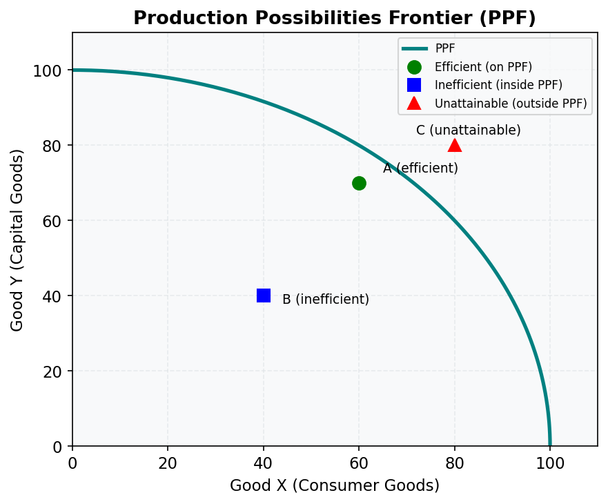

# M01.L02 — The Production Possibilities Frontier: Trade-offs and Economic Growth

**Module:** Module 01 — Introduction: Scarcity, Choice, and the Economic Method  
**Lesson:** L02 of 05  
**Duration:** ~30 minutes  
**Level:** Introductory  
**Provenance:** [OpenStax Principles of Microeconomics 3e](https://socialsci.libretexts.org/Bookshelves/Economics/Microeconomics/Principles_of_Microeconomics_3e_(OpenStax)) | [MIT OCW 14.01 Principles of Microeconomics](https://ocw.mit.edu/courses/14-01-principles-of-microeconomics-fall-2023/)

---

## Learning Objective

!!! info "Key Diagram"
      
    *Figure 1: The Production Possibilities Frontier. Points on the curve are productively efficient; the bowed shape reflects increasing opportunity costs.*

Illustrate economic trade-offs using the PPF model.

---

## Understanding the PPF

The Production Possibilities Frontier (PPF) shows all possible combinations of two goods an economy can produce given its resources and technology. Australia's economy often faces choices between:
- Mining exports (iron ore, coal) vs. manufacturing
- Urban development vs. agricultural land
- Renewable energy investment vs. fossil fuel production

Points on the curve represent efficient production, inside are inefficient, and outside are unattainable with current resources. The bowed shape reflects increasing opportunity costs - producing more of one good requires ever-larger sacrifices of the other.

---

## Worked Example

**Australia's Iron Ore vs. Wine Production**

1. Suppose Australia can produce either 100M tons of iron ore or 10M bottles of wine annually at full capacity.
2. Moving from 80M tons ore to 90M tons might require sacrificing 1M wine bottles.
3. But increasing to 95M tons could cost 3M wine bottles due to reallocating less suitable resources.
4. Economic growth (new mining tech, better vines) shifts the PPF outward over time.

---

## Common Misconception

> "Points inside the PPF are bad and should always be avoided"

While inefficient, these points may represent temporary unemployment during economic downturns or deliberate underutilization to conserve resources for future use.

---

## Key Takeaways

- The PPF demonstrates opportunity costs through its slope
- Economic growth shifts the PPF outward through better technology or more resources
- Specialization and trade allow consumption beyond a country's PPF
- The bowed shape reflects increasing opportunity costs in real economies

---

## Practice

1. Draw a PPF for Australia choosing between education and tourism services. Why might it be bowed?
2. How would discovering new iron ore deposits affect Australia's PPF for ore vs. agriculture?
3. Explain why two countries trading can both consume beyond their individual PPFs.

---

## Further Resources

- 📺 [Production Possibilities Frontier](https://www.khanacademy.org/economics-finance-domain/microeconomics/basic-economic-concepts-gen-micro/production-possibilities/v/production-possibilities-frontier) — Khan Academy's interactive explanation
- 📺 [PPF and Opportunity Cost](https://www.youtube.com/watch?v=O6XL__2CDPU) — MIT lecture with mathematical treatment
- 📚 [RBA Chart Pack: Mining Investment](https://www.rba.gov.au/chart-pack/mining-investment.html) — Real Australian production trade-offs

---

**Provenance:** [OpenStax Principles of Microeconomics 3e](https://socialsci.libretexts.org/Bookshelves/Economics/Microeconomics/Principles_of_Microeconomics_3e_(OpenStax)) | [MIT OCW 14.01 Principles of Microeconomics](https://ocw.mit.edu/courses/14-01-principles-of-microeconomics-fall-2023/)