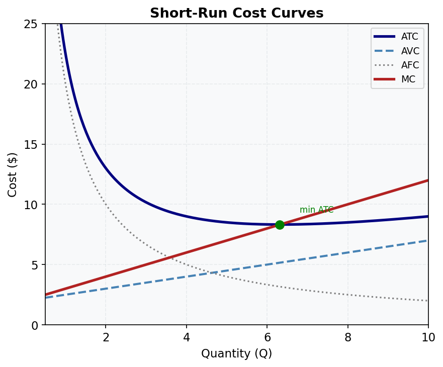

# M03.L03 — Short-Run Costs: Fixed, Variable, Average, and Marginal

**Module:** Module 03 — Production and Costs  
**Lesson:** L03 of 05  
**Duration:** ~30 minutes  
**Level:** Introductory  
**Provenance:** [Microeconomics 1e (Medeiros)](https://socialsci.libretexts.org/Bookshelves/Economics/Microeconomics/Microeconomics_1e_(Medeiros)) | [Khan Academy Microeconomics](https://www.khanacademy.org/economics-finance-domain/microeconomics)

---

## Learning Objective

!!! info "Key Diagram"
      
    *Figure 4: Short-Run Cost Curves. MC intersects both AVC and ATC at their minimum points. The gap between ATC and AVC equals AFC.*

Calculate and interpret different cost measures in the short run.

---

## Short-Run Cost Concepts

Australian cafes face:
- Fixed Costs (TFC): Rent, equipment leases (constant at $1000/week)
- Variable Costs (TVC): Wages, ingredients (increase with output)
- Total Cost (TC) = TFC + TVC

Average Costs:
- AFC = TFC/Q (always decreasing)
- AVC = TVC/Q (U-shaped)
- ATC = TC/Q (U-shaped)

Marginal Cost (MC) = ΔTC/ΔQ:
- Initially falls then rises
- Intersects AVC and ATC at their minimum points

---

## Worked Example

**Sydney Café Costs**

At 100 coffees/day:
- TFC = $1000
- TVC = $500
- TC = $1500
- AFC = $10
- AVC = $5
- ATC = $15
- MC (from 99 to 100) = $4.90

At 200 coffees:
- TFC = $1000
- TVC = $900
- TC = $1900
- AFC = $5
- AVC = $4.50
- ATC = $9.50
- MC = $4

---

## Common Misconception

> "Fixed costs don't affect production decisions."

Actually, while fixed costs don't change with output, they determine whether firms can cover total costs in the long run. Many Australian startups fail by underestimating fixed costs.

---

## Key Takeaways

- TFC are constant; TVC increase with output
- ATC is U-shaped due to AFC and AVC
- MC intersects AVC and ATC at their minimums
- Cost curves reflect production function

---

## Practice

1. If TC=2000 at Q=100 and TC=2400 at Q=120, what is MC?
2. Why is ATC U-shaped?
3. Draw AFC, AVC, ATC, and MC curves showing relationships.

---

## Further Resources

- 📺 [Short-Run Costs](https://www.khanacademy.org/economics-finance-domain/microeconomics/firm-economic-profit) — Khan Academy
- 📚 [Cost Analysis](https://socialsci.libretexts.org/Bookshelves/Economics/Microeconomics/Microeconomics_1e_(Medeiros)) — Medeiros

---

**Provenance:** [Microeconomics 1e (Medeiros)](https://socialsci.libretexts.org/Bookshelves/Economics/Microeconomics/Microeconomics_1e_(Medeiros)) | [Khan Academy Microeconomics](https://www.khanacademy.org/economics-finance-domain/microeconomics)