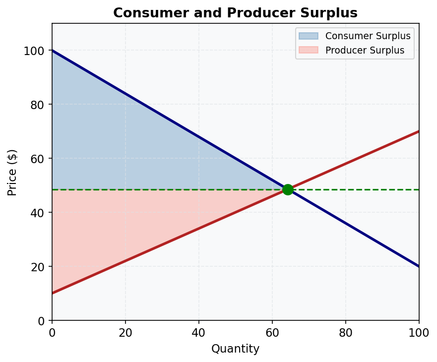

# M05.L01 — Consumer Surplus: Concept and Calculation

**Module:** Module 05 — Economic Surplus and Elasticity
**Lesson:** L01 of 06
**Duration:** ~30 minutes
**Level:** Introductory
**Provenance:** [OpenStax Principles of Microeconomics 3e](https://socialsci.libretexts.org/Bookshelves/Economics/Microeconomics/Principles_of_Microeconomics_3e_(OpenStax)) | [Khan Academy Microeconomics](https://www.khanacademy.org/economics-finance-domain/microeconomics)

---

## Learning Objective

!!! info "Key Diagram"
      
    *Figure 3: Consumer and Producer Surplus. The blue area is consumer surplus; the red area is producer surplus. Together they equal total economic surplus.*

Understand how to calculate and interpret consumer surplus using Australian market examples.

---

## Consumer Surplus Basics

Consumer surplus (CS) measures the benefit consumers receive when they pay less for a good or service than their maximum willingness to pay (WTP). It is calculated as the difference between WTP and the actual price paid, summed across all units purchased. Graphically, CS is the area below the demand curve but above the price line.

In Australia, CS can be observed in markets like petrol, where price fluctuations (e.g., due to excise taxes) directly impact consumer welfare. For example, if a consumer is willing to pay $1.80 per litre for petrol but the market price is $1.50, their CS is $0.30 per litre.

---

## Worked Example

**Calculating CS for Concert Tickets in Sydney**

1. **Demand Curve:** Suppose the demand for concert tickets is linear, with a maximum WTP of $200 (intercept) and a slope of -$10 per ticket. The equation is: \( P = 200 - 10Q \).
2. **Market Price:** Tickets sell at $120.
3. **Equilibrium Quantity:** \( 120 = 200 - 10Q \) → \( Q = 8 \).
4. **CS Calculation:** Area of the triangle = \( \frac{1}{2} \times base \times height \) = \( \frac{1}{2} \times 8 \times (200-120) \) = $320.

---

## Common Misconception

> "Consumer surplus is the same as profit."

CS measures consumer benefit, not producer revenue or profit. Profit is revenue minus costs, while CS reflects the gap between willingness to pay and actual price.

---

## Key Takeaways

- CS = WTP minus price, represented as the area under the demand curve above the price.
- CS increases when prices fall (e.g., petrol excise cuts) and decreases when prices rise.
- Linear demand curves yield triangular CS areas.
- Australian examples include petrol, electricity, and event tickets.

---

## Application: The Rule of Half (Infrastructure Appraisal)

When a project lowers the cost of a service (e.g., a new motorway reducing travel time), consumer surplus rises. Two groups benefit:

- **Existing users** — gain on all their current trips: CS gain = ΔCost × Q₀
- **New users** — induced by the lower cost; their average gain is half the cost reduction: CS gain = ½ × ΔCost × ΔQ

Combined: **Total CS benefit = ΔCost × Q₀ + ½ × ΔCost × ΔQ = ΔCost × (Q₀ + ½ΔQ)**

This is the **Rule of Half**, standard in Australian government cost-benefit analysis (e.g., Infrastructure Australia, Transport for NSW).

**Example — Western Sydney Airport Rail Link:** A new rail link reduces travel time by 12 minutes (valued at $20/hr = $4 per trip). Existing users: 100,000 trips/year. New trips induced: 10,000/year.
- Existing user benefit: $4 × 100,000 = **$400,000/year**
- New user benefit: ½ × $4 × 10,000 = **$20,000/year**
- Total annual CS benefit: **$420,000/year**

---

## Practice

1. If the WTP for a coffee is $5.50 but the price is $4.00, what is the CS per coffee?
2. Draw a demand curve with WTP = $100 at Q=0 and P=0 at Q=10. Calculate CS at P=$40.
3. How does a price ceiling below equilibrium affect CS?
4. A road upgrade reduces commute costs by $3/trip. Current users: 50,000 trips/day; new induced trips: 5,000/day. Using the Rule of Half, calculate the daily consumer surplus benefit.

---

## Further Resources

- 📺 [Consumer Surplus Explained](https://www.khanacademy.org/economics-finance-domain/microeconomics) — Khan Academy video
- 📚 [OpenStax Consumer Surplus](https://socialsci.libretexts.org/Bookshelves/Economics/Microeconomics/Principles_of_Microeconomics_3e_(OpenStax))

---

**Provenance:** [OpenStax Principles of Microeconomics 3e](https://socialsci.libretexts.org/Bookshelves/Economics/Microeconomics/Principles_of_Microeconomics_3e_(OpenStax)) | [Khan Academy Microeconomics](https://www.khanacademy.org/economics-finance-domain/microeconomics)