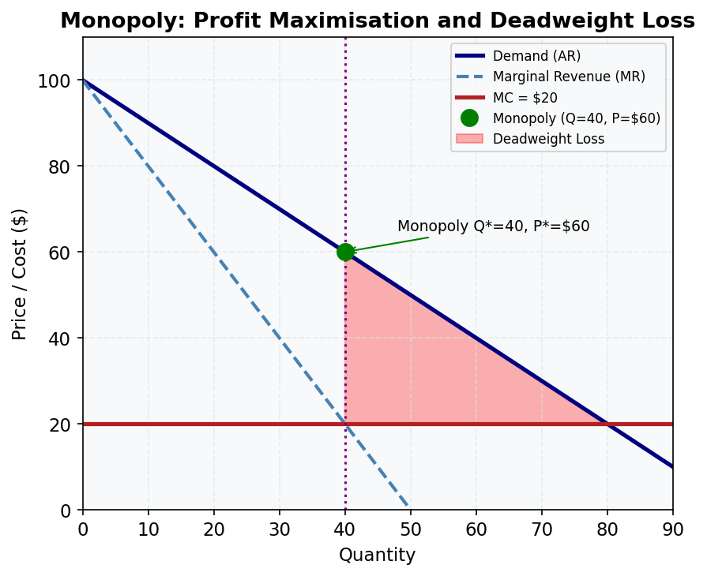

# M07.L03 — Profit Maximisation for a Monopolist

**Module:** Module 07 — Monopoly
**Lesson:** L03 of 06
**Duration:** ~30 minutes
**Level:** Introductory
**Provenance:** [OpenStax Principles of Microeconomics 3e](https://socialsci.libretexts.org/Bookshelves/Economics/Microeconomics/Principles_of_Microeconomics_3e_(OpenStax)) | [Khan Academy Microeconomics](https://www.khanacademy.org/economics-finance-domain/microeconomics)

---

## Learning Objective

!!! info "Key Diagram"
      
    *Figure 6: Monopoly. The monopolist produces where MR = MC (Q*=40, P*=$60). The red triangle shows deadweight loss — units not produced despite creating positive surplus.*

Determine the profit-maximizing quantity and price for a monopolist.

---

## The MR = MC Rule

A monopolist maximizes profit by producing where Marginal Revenue (MR) equals Marginal Cost (MC):

1. Find Q* where MR = MC
2. Determine P* from the demand curve at Q*
3. Calculate profit as (P* - ATC) × Q*

Key implications:
- Monopolists produce less than the socially optimal quantity (where P = MC)
- They charge a price above MC, creating deadweight loss
- Profit depends on the ATC at Q* - even with market power, high costs can eliminate profits

---

## Worked Example

**Australian Pharmaceutical Monopoly**

Given:
- Demand: P = 100 - Q
- MC = $20 constant
- ATC = $40 at Q*

Steps:
1. MR = 100 - 2Q (twice demand slope)
2. Set MR = MC: 100 - 2Q = 20 → Q* = 40
3. Find P* = 100 - 40 = $60
4. Profit = (60 - 40) × 40 = $800

This shows how patent-protected drugs can maintain high prices until generics enter.

---

## Common Misconception

> "Monopolists always charge the highest possible price"

Monopolists maximize profit, not price. Charging the absolute highest price would minimize quantity sold. The optimal price balances per-unit profit against total sales volume.

---

## Key Takeaways

- Profit max occurs where MR = MC
- Price is determined from demand at Q*
- Graphical method: 1) Find MR=MC, 2) Up to demand for P, 3) Compare P to ATC
- Monopolists produce in the elastic region of demand (where MR > 0)
- Barriers to entry allow long-run economic profits

---

## Practice

1. If MC rises to $30 in our example, what happens to Q* and P*?
2. Why can't a monopolist use the P = MC rule like competitive firms?
3. How would a per-unit tax affect the monopolist's output decision?

---

## Further Resources

- 📺 [Monopoly Profit Maximization](https://www.khanacademy.org/economics-finance-domain/ap-microeconomics/imperfect-competition/monopolies-tutorial/v/monopolist-optimizing-price-part-2-marginal-revenue) — Khan Academy
- 📚 [Pharmaceutical Patents in Australia](https://www.pc.gov.au/inquiries/completed/intellectual-property/report)

---

**Provenance:** [OpenStax Principles of Microeconomics 3e](https://socialsci.libretexts.org/Bookshelves/Economics/Microeconomics/Principles_of_Microeconomics_3e_(OpenStax)) | [Khan Academy Microeconomics](https://www.khanacademy.org/economics-finance-domain/microeconomics)