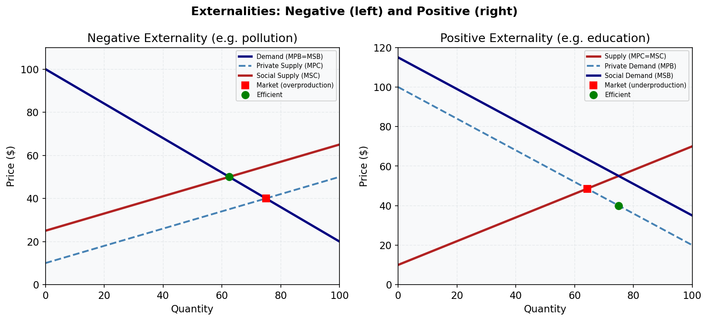

# M10.L01 — Externalities: Negative and Positive

**Module:** Module 10 — Externalities and Market Failure
**Lesson:** L01 of 05
**Duration:** ~30 minutes
**Level:** Introductory
**Provenance:** [OpenStax Principles of Microeconomics 3e](https://socialsci.libretexts.org/Bookshelves/Economics/Microeconomics/Principles_of_Microeconomics_3e_(OpenStax)) | [Microeconomics 1e (Medeiros)](https://socialsci.libretexts.org/Bookshelves/Economics/Microeconomics/Microeconomics_1e_(Medeiros))

---

## Learning Objective

!!! info "Key Diagram"
      
    *Figure 7: Externalities. A negative externality (left) causes overproduction; a positive externality (right) causes underproduction. Government intervention can restore efficiency.*

Define and differentiate between negative and positive externalities using Australian examples.

---

## Understanding Externalities

An externality occurs when a third party is affected by an economic activity, but this impact is not reflected in the market price. Externalities can be negative (costs imposed) or positive (benefits conferred). In Australia, coal mining is a classic example of a negative externality due to pollution, while vaccination programs demonstrate positive externalities by reducing disease spread.

---

## Worked Example

**Calculating Social Cost of Coal Mining in Queensland**

1. **Private Cost:** Mining company spends $50/tonne on extraction.
2. **External Cost:** Pollution impacts local health and agriculture, valued at $30/tonne.
3. **Social Cost:** $50 + $30 = $80/tonne.
4. **Market Outcome:** Without regulation, the market produces at private cost ($50), leading to overproduction compared to the socially optimal level.

---

## Common Misconception

> "Externalities only affect the immediate parties in a transaction."

Externalities extend beyond buyers and sellers to third parties. For example, a factory's pollution affects the entire community, not just its customers or workers.

---

## Key Takeaways

- Negative externalities lead to overproduction; positive externalities lead to underproduction.
- Social cost includes private cost plus external cost.
- Market prices often fail to account for externalities.
- Government intervention (e.g., taxes, subsidies) can correct externality-driven inefficiencies.

---

## Practice

1. Why does a market without regulation overproduce goods with negative externalities?
2. How does vaccination create a positive externality?
3. Draw a graph showing the difference between private and social cost curves.

---

## Further Resources

- 📺 [Negative Externalities (Khan Academy)](https://www.khanacademy.org/economics-finance-domain/microeconomics/market-failure-and-the-role-of-government/externalities-topic/v/negative-externalities) — Visual explanation of negative externalities
- 📚 [Australian Government Pollution Policies](https://www.dcceew.gov.au/) — Overview of environmental regulations

---

**Provenance:** [OpenStax Principles of Microeconomics 3e](https://socialsci.libretexts.org/Bookshelves/Economics/Microeconomics/Principles_of_Microeconomics_3e_(OpenStax)) | [Microeconomics 1e (Medeiros)](https://socialsci.libretexts.org/Bookshelves/Economics/Microeconomics/Microeconomics_1e_(Medeiros))