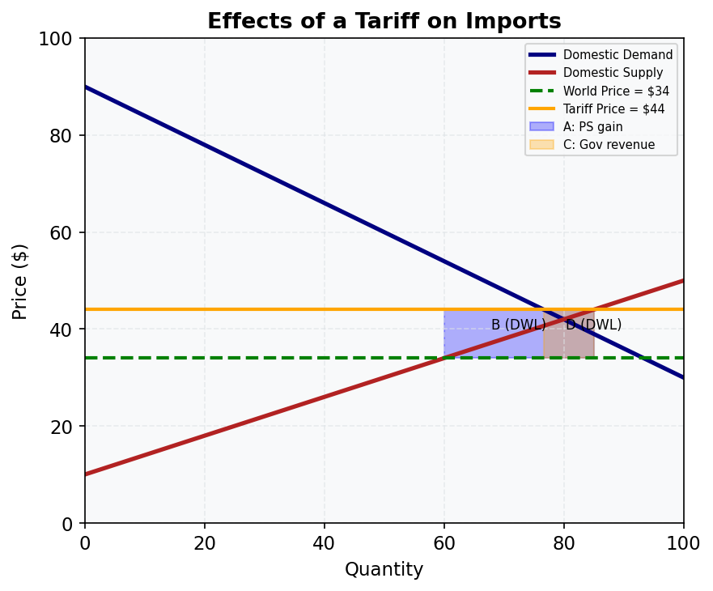

# M12.L03 — Trade Barriers: Tariffs, Quotas, and Their Effects

**Module:** Module 12 — International Trade and Synthesis  
**Lesson:** L03 of 05  
**Duration:** ~30 minutes  
**Level:** Introductory  
**Provenance:** [OpenStax Principles of Microeconomics 3e](https://socialsci.libretexts.org/Bookshelves/Economics/Microeconomics/Principles_of_Microeconomics_3e_(OpenStax)) | [MIT OCW 14.01 Principles of Microeconomics](https://ocw.mit.edu/courses/14-01-principles-of-microeconomics-fall-2023/)

---

## Learning Objective

!!! info "Key Diagram"
      
    *Figure 8: Tariff Effects. Areas A (blue) = producer surplus gain; C (orange) = government revenue; B and D = deadweight loss borne by society.*

Calculate the welfare effects of a tariff on consumers, producers, government, and total surplus.

---

## Tariffs: A Tax on Imports

A **tariff** is a tax levied on imported goods. When a government imposes a tariff of $T per unit:

1. The domestic price rises from the world price P_W to P_W + T
2. Domestic quantity supplied rises (domestic producers expand)
3. Domestic quantity demanded falls (consumers face higher prices)
4. Imports = Q_D − Q_S fall

**Welfare effects:**
- **Consumer surplus falls** (area A + B + C + D)
- **Producer surplus rises** (area A)
- **Government revenue rises** (area C = tariff × imports)
- **Deadweight loss** = areas B + D (triangles representing efficiency loss)

Net welfare effect: consumers lose more than producers + government gain → net loss = DWL (areas B + D).

---

## Quotas

A **quota** limits the *quantity* of imports directly. Effects on domestic price, output, and consumption are similar to a tariff — but the revenue rectangle (area C) goes to **quota licence holders** (often importers), not the government. This makes quotas generally less efficient than equivalent tariffs from a national welfare perspective.

**Voluntary Export Restraints (VERs):** An agreement where a foreign country limits its own exports. The revenue equivalent goes to foreign exporters — even worse for the importing country's welfare.

---

## Australia's Tariff History

Australia historically protected manufacturing through high tariffs (25–35% in the 1960s–70s). Progressive tariff reductions from the 1980s under the Hawke–Keating governments exposed Australian manufacturers to international competition. The car industry's tariffs fell from 57.5% (1988) to 5% (2010). Most Australian tariffs are now 0–5%, with the standard rate at 5%.

---

## Worked Example

**Tariff on imported steel in Australia**

World price P_W = $600/tonne. Tariff = $150/tonne → domestic price = $750.

At $600: Q_S = 2m tonnes, Q_D = 8m tonnes → imports = 6m tonnes  
At $750: Q_S = 3.5m tonnes, Q_D = 6.5m tonnes → imports = 3m tonnes

- Consumer surplus loss: large area (consumers pay $150 more on all 6.5m tonnes purchased)
- Producer surplus gain: domestic producers gain on 3.5m tonnes
- Government revenue: $150 × 3m = $450m
- Deadweight loss: two triangles from reduced imports and distorted production

Net effect: Australians as a whole lose; steel producers and government gain at consumers' expense.

---

## Common Misconception

> **"Tariffs protect jobs and are good for the economy."**

Tariffs protect jobs in the protected industry but destroy jobs elsewhere — consumers spend less on other goods (due to higher import prices), and export industries lose competitiveness as trading partners retaliate. The net employment effect is typically zero or negative; the real effect is a redistribution from consumers to protected producers.

---

## Key Takeaways

- Tariffs raise domestic prices, reduce imports, generate government revenue, and create deadweight loss
- Quotas have similar price/quantity effects but transfer revenue to quota holders, not government
- Australia dramatically reduced tariffs from the 1980s onwards; most goods now face 0–5%
- Net welfare effect of tariffs is negative — losses to consumers exceed gains to producers and government

---

## Practice

1. Draw a supply-demand diagram for an imported good. Mark the world price, the tariff-inclusive price, and label areas A, B, C, D. Identify what each area represents.
2. If Australia imposes a $20/tonne tariff on imported sugar: domestic production rises from 3m to 4m tonnes, consumption falls from 9m to 7m tonnes. Calculate government tariff revenue.
3. Why is a quota generally considered less efficient than a tariff that achieves the same import reduction?

---

## Further Resources

- 📺 [Tariffs and Quotas (Khan Academy)](https://www.khanacademy.org/economics-finance-domain/microeconomics/ap-imperfect-competition/ap-trade-and-welfare/v/tariffs) — welfare analysis of trade barriers
- 📺 [University of Utah — Trade Policy](https://www.youtube.com/playlist?list=PL552482304A47A7B3) — principles of trade policy
- 📚 [OpenStax Microeconomics — Trade Policy](https://socialsci.libretexts.org/Bookshelves/Economics/Microeconomics/Principles_of_Microeconomics_3e_(OpenStax))

---

**Provenance:** [OpenStax Principles of Microeconomics 3e](https://socialsci.libretexts.org/Bookshelves/Economics/Microeconomics/Principles_of_Microeconomics_3e_(OpenStax)) | [MIT OCW 14.01 Principles of Microeconomics](https://ocw.mit.edu/courses/14-01-principles-of-microeconomics-fall-2023/)
