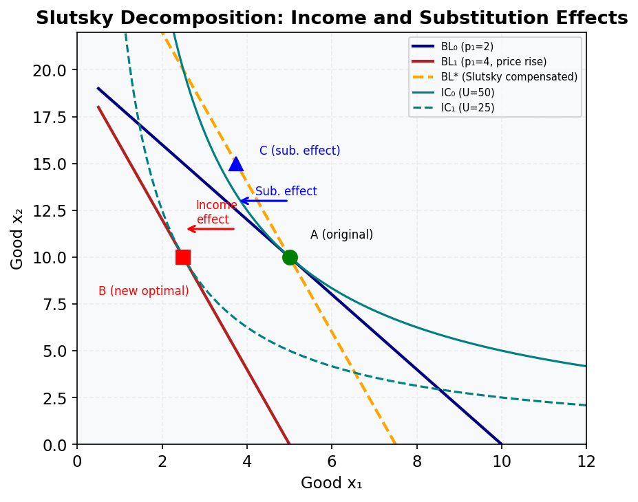

# M15.L01 — The Slutsky Equation: Decomposing Price Effects

**Module:** Module 15 — Comparative Statics and Demand Theory
**Lesson:** L01 of 05
**Duration:** ~30 minutes
**Level:** Intermediate
**Provenance:** [Intermediate Microeconomics with Excel (Barreto)](https://socialsci.libretexts.org/Bookshelves/Economics/Microeconomics/Intermediate_Microeconomics_with_Excel_(Barreto)) | [MIT OCW 14.01 Principles of Microeconomics](https://ocw.mit.edu/courses/14-01-principles-of-microeconomics-fall-2023/)

---

## Learning Objective

!!! info "Key Diagram"
      
    *Figure 10: Slutsky Decomposition. A price rise moves the consumer from A to B. The substitution effect (A→C, along the compensated budget line) and income effect (C→B) sum to the total effect.*

Derive and interpret the Slutsky equation to decompose price effects into substitution and income effects.

---

## Price Effect Decomposition

The Slutsky equation (∂x₁/∂p₁ = ∂x₁ʰ/∂p₁ - x₁ × ∂x₁/∂m) shows how a price change affects demand through two channels:
1. **Substitution effect** (∂x₁ʰ/∂p₁): Always negative for own-price changes, showing the pure effect of relative price changes holding utility constant.
2. **Income effect** (-x₁ × ∂x₁/∂m): Sign depends on whether the good is normal (negative) or inferior (positive).

In Australia, consider fuel prices: a 10% price increase reduces consumption through both effects - consumers substitute toward public transport (substitution) and have less real income (income effect).

---

## Worked Example

**Calculating Slutsky Decomposition for Australian Coffee Demand**

Given:
- Initial consumption: x₁ = 5 cups/week at p₁ = $4
- Price increase to $5
- Hicksian demand slope: ∂x₁ʰ/∂p₁ = -2
- Income effect: ∂x₁/∂m = 0.1

Substitution effect = -2 cups/$
Income effect = -5 × 0.1 = -0.5 cups/$
Total effect = -2 + (-0.5) = -2.5 cups/$

---

## Common Misconception

> "The income effect is always negative"

This only holds for normal goods. For inferior goods (e.g., instant noodles during economic downturns), the income effect is positive - as real income decreases, demand increases.

---

## Key Takeaways

- The Slutsky equation mathematically separates price effects
- Substitution effect always opposes price changes
- Income effect sign reveals good's normality
- Matrix form shows demand theory consistency conditions

---

## Practice

1. Derive the Slutsky equation for x₂ when p₁ changes
2. Calculate effects when ∂x₁ʰ/∂p₁ = -1.5, x₁ = 3, ∂x₁/∂m = 0.2
3. Graphically show how a Giffen good violates standard assumptions

---

## Further Resources

- 📺 [Slutsky Equation Visualized](https://youtu.be/6HhL6r2mUSg) — MIT OpenCourseWare
- 📚 [Demand Theory](https://socialsci.libretexts.org/Bookshelves/Economics/Microeconomics/Intermediate_Microeconomics_with_Excel_(Barreto)/05%3A_Comparative_Statics)

---

**Provenance:** [Barreto](https://socialsci.libretexts.org/Bookshelves/Economics/Microeconomics/Intermediate_Microeconomics_with_Excel_(Barreto)) | [MIT OCW](https://ocw.mit.edu)