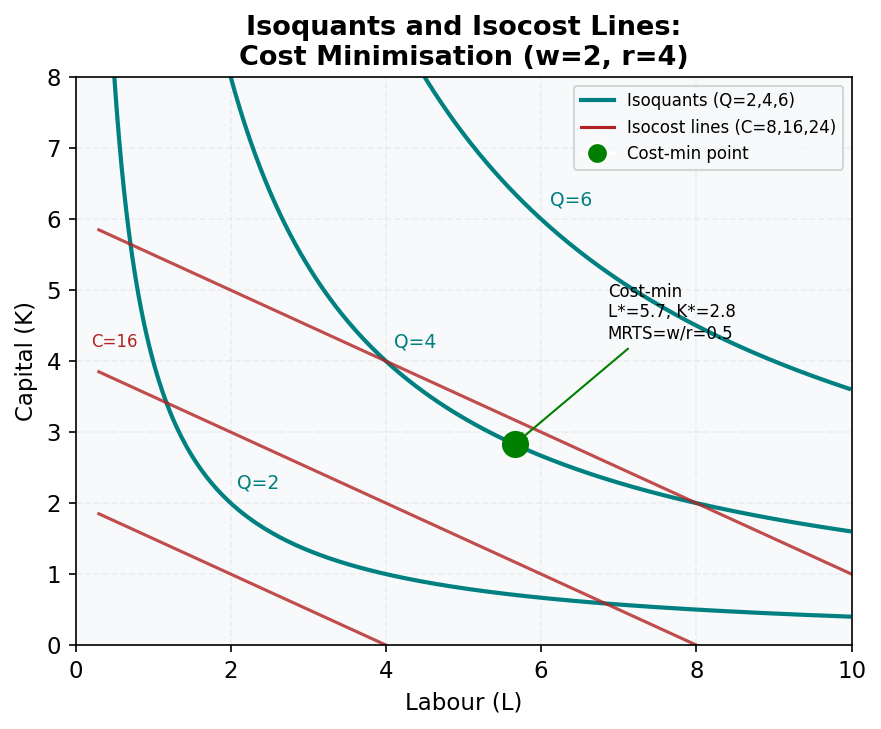

# M18.L03 — Cost Minimisation: The Isocost-Isoquant Approach

**Module:** Module 18 — Technology, Production, and Profit Maximisation
**Lesson:** L03 of 05
**Duration:** ~30 minutes
**Level:** Intermediate
**Provenance:** [Intermediate Microeconomics with Excel (Barreto)](https://socialsci.libretexts.org/Bookshelves/Economics/Microeconomics/Intermediate_Microeconomics_with_Excel_(Barreto)) | [MIT OCW 14.01 Principles of Microeconomics](https://ocw.mit.edu/courses/14-01-principles-of-microeconomics-fall-2023/)

---

## Learning Objective

!!! info "Key Diagram"
      
    *Figure 12: Cost Minimisation. The firm minimises cost at the tangency of the isocost line and isoquant — where MRTS = w/r.*

Derive cost-minimizing input combinations using isocost-isoquant tangency.

---

## Cost Minimisation

Given input prices \(w_1\) and \(w_2\), the firm minimizes cost \(C = w_1x_1 + w_2x_2\) subject to producing output \(y\).

### Key Concepts:
1. **Isocost Line:** \(w_1x_1 + w_2x_2 = C\). Slope = \(-w_1/w_2\).
2. **Tangency Condition:** MRTS = input price ratio: \(\frac{MP_1}{MP_2} = \frac{w_1}{w_2}\).
3. **Conditional Factor Demands:** \(x_1^*(w_1, w_2, y)\) and \(x_2^*(w_1, w_2, y)\) solve the cost-minimization problem.
4. **Cost Function:** \(C(w_1, w_2, y)\) is the minimized cost.
5. **Shephard’s Lemma:** \(\frac{\partial C}{\partial w_i} = x_i^*\).

---

## Worked Example

**[Australian context]**

An Australian brewery uses labor (\(x_1\)) and barley (\(x_2\)) with \(y = x_1^{0.5}x_2^{0.5}\). Input prices: \(w_1 = 20\) AUD/hour, \(w_2 = 5\) AUD/kg.
1. **Tangency Condition:**
   \[
   \frac{MP_1}{MP_2} = \frac{x_2}{x_1} = \frac{w_1}{w_2} = 4 \implies x_2 = 4x_1
   \]
2. **Substitute into Production Function:**
   \[
   y = x_1^{0.5}(4x_1)^{0.5} = 2x_1 \implies x_1^* = \frac{y}{2}, \quad x_2^* = 2y
   \]
3. **Cost Function:**
   \[
   C = 20 \left(\frac{y}{2}\right) + 5 (2y) = 20y
   \]

---

## Common Misconception

> "Cost minimization always occurs where MRTS = price ratio."

Only true for interior solutions. Corner solutions (e.g., perfect substitutes) may not satisfy tangency.

---

## Key Takeaways

- Cost minimization requires equating MRTS to input price ratio.
- Shephard’s Lemma links cost function derivatives to conditional factor demands.
- Cobb-Douglas production leads to linear conditional demands in output.

---

## Practice

1. For \(y = x_1 + x_2\) and \(w_1 = 2\), \(w_2 = 3\), find cost-minimizing inputs.
2. Derive Shephard’s Lemma for \(C = 2w_1^{0.5}w_2^{0.5}y\).

---

## Further Resources

- 📺 [MIT: Cost Minimization](https://ocw.mit.edu/courses/14-01-principles-of-microeconomics-fall-2023/)
- 📚 [Brewery Cost Analysis in Australia](https://socialsci.libretexts.org/Bookshelves/Economics/Microeconomics/Intermediate_Microeconomics_with_Excel_(Barreto))

---

**Provenance:** [Intermediate Microeconomics with Excel (Barreto)](https://socialsci.libretexts.org/Bookshelves/Economics/Microeconomics/Intermediate_Microeconomics_with_Excel_(Barreto)) | [MIT OCW 14.01 Principles of Microeconomics](https://ocw.mit.edu/courses/14-01-principles-of-microeconomics-fall-2023/)